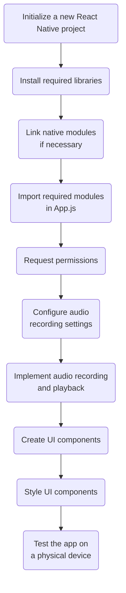

### Step 1: Set up a new React Native project

Initialize a new React Native project using the React Native CLI or Expo CLI, and navigate to the project directory:

```bash
npx react-native init AudioRecorderApp
cd AudioRecorderApp
```

### Step 2: Install the required libraries

Install the `react-native-sound`, `react-native-audio`, and `react-native-share` libraries for audio playback, recording, and sharing, respectively:

```bash
npm install react-native-sound react-native-audio react-native-share
```

### Step 3: Link the native modules

For React Native versions below 0.60, you need to link the native modules:

```bash
react-native link react-native-sound react-native-audio react-native-share
```

### Step 4: Import the required modules

Import the `AudioRecorder`, `Sound`, and `Share` modules at the top of the `App.js` file:

```javascript
import AudioRecorder from 'react-native-audio';
import Sound from 'react-native-sound';
import Share from 'react-native-share';
```

### Step 5: Request permissions

Request the required permissions for audio recording. Add the following code inside the `App` component:

```javascript
useEffect(() => {
  const requestPermissions = async () => {
    try {
      await AudioRecorder.requestAuthorization();
    } catch (error) {
      console.log('Failed to request permissions', error);
    }
  };
  requestPermissions();
}, []);
```

### Step 6: Configure audio recording settings

Configure the audio recording settings by setting the audio quality, encoding, and channels. Add the following code inside the `App` component:

```javascript
useEffect(() => {
  AudioRecorder.prepareRecordingAtPath(audioFile, {
    SampleRate: 22050,
    Channels: 1,
    AudioQuality: 'Low',
    AudioEncoding: 'wav',
    AudioEncodingBitRate: 32000,
  });
}, []);
```

### Step 7: Implement audio recording and playback

Create the `startRecording`, `stopRecording`, and `playRecording` functions within the `App` component to handle audio recording and playback:

```javascript
// Add your startRecording function here

// Add your stopRecording function here

const playRecording = (audioFile) => {
  const sound = new Sound(audioFile, '', (error) => {
    if (error) {
      console.log('Failed to load the sound', error);
      return;
    }
    sound.play((success) => {
      if (!success) {
        console.log('Sound did not play successfully');
      }
      sound.release();
    });
  });
};
```

### Step 8: Create UI components

Add UI components for recording, playing, and sharing the audio files within the `SafeAreaView` in `App.js`:

```javascript
// Add your TouchableOpacity components here for record, play, and share buttons
```

### Step 9: Style the UI components

Add styles for the record, play, and share buttons in the `styles` object:

```javascript
// Add your styles for recordButton, playButton, and shareButton here
```

### Step 10: Test the app

Test the app on a physical device for accurate results, as the simulator may have limited microphone and speaker functionalities.

With these steps, you now have a React Native app that records audio, saves the recordings as audio files, plays them back, and allows you to share the recorded audio files. Here is a summary of the complete `App.js` file for reference:

```javascript
import React, {useEffect} from 'react';
import {
  SafeAreaView,
  TouchableOpacity,
  StyleSheet,
} from 'react-native';
import Icon from 'react-native-vector-icons/FontAwesome';
import AudioRecorder from 'react-native-audio';
import Sound from 'react-native-sound';
import Share from 'react-native-share';

const App = () => {
  const audioFile = 'testRecording.wav';

  useEffect(() => {
    const requestPermissions = async () => {
      try {
        await AudioRecorder.requestAuthorization();
      } catch (error) {
        console.log('Failed to request permissions', error);
      }
    };
    requestPermissions();
  }, []);

  useEffect(() => {
    AudioRecorder.prepareRecordingAtPath(audioFile, {
      SampleRate: 22050,
      Channels: 1,
      AudioQuality: 'Low',
      AudioEncoding: 'wav',
      AudioEncodingBitRate: 32000,
    });
  }, []);

  // Add your startRecording, stopRecording, and playRecording functions here

  return (
    <SafeAreaView style={styles.container}>
      // Add your TouchableOpacity components here for record, play, and share buttons
    </SafeAreaView>
  );
};

const styles = StyleSheet.create({
  container: {
    flex: 1,
    justifyContent: 'center',
    alignItems: 'center',
    backgroundColor: '#F5FCFF',
  },
  // Add your styles for recordButton, playButton, and shareButton here
});

export default App;
```

To test the app on a physical device, follow these steps:

1.  Connect your physical device to your computer via USB.
    
2.  Enable USB debugging on your device (for Android devices) or trust your computer (for iOS devices).
    
3.  Run the following command in your terminal to build and launch the app:
    
    For Android:
    
    ```bash
    npx react-native run-android
    ```
    
    For iOS:
    
    ```bash
    npx react-native run-ios
    ```
    
4.  The app should now be installed on your device, and you can test the audio recording, playback, and sharing features.
    

If you encounter any issues during testing, make sure to check the error logs in your terminal, and consult the documentation for the libraries used in this tutorial for troubleshooting guidance.
